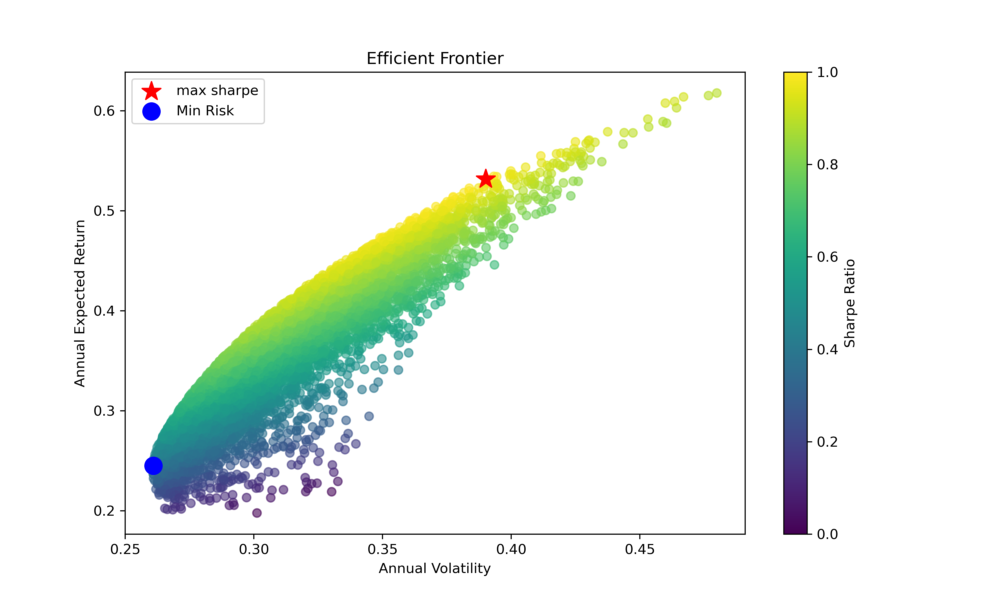

# Monte-carlo-mean-variance-portfolio-optimizer-Markowitz-Framework-
Modern Portfolio Theory implementation in Python with Monte Carlo simulation, annualized risk-return modeling, and optimal asset allocation.

# Monte Carlo Mean-Variance Portfolio Optimizer (Markowitz Framework)

## Overview

This project implements Modern Portfolio Theory (Markowitz Framework) using Monte Carlo simulation to construct an optimal portfolio based on historical market data.

The model:

- Downloads real stock data from Yahoo Finance
- Computes annualized expected returns
- Builds covariance matrix
- Simulates 10,000 portfolio allocations
- Identifies:
  - Maximum Sharpe Ratio portfolio
  - Minimum Volatility portfolio
- Plots the Efficient Frontier

---

## Assets Used

- AMZN
- NVDA
- AAPL
- JPM

Period: 2019–2024

---

## Mathematical Foundation

Portfolio Return:

\[
R_p = w^T \mu
\]

Portfolio Variance:

\[
\sigma^2 = w^T \Sigma w
\]

Sharpe Ratio:

\[
S = \frac{R_p}{\sigma_p}
\]

---

## Results

Efficient Frontier Visualization:

